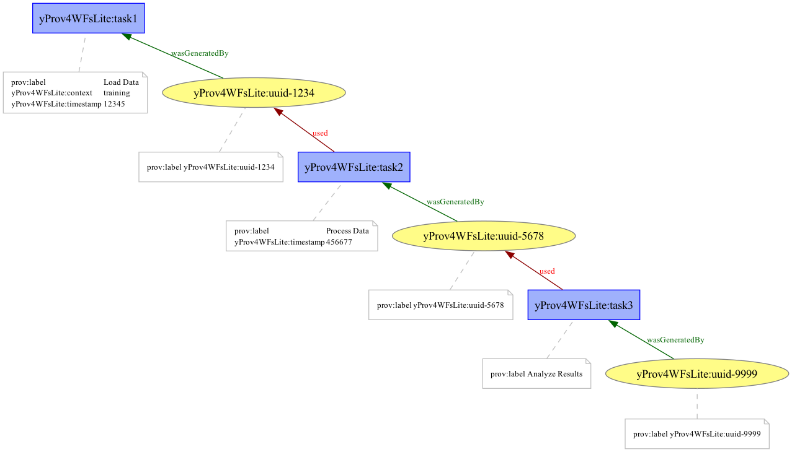

# yProv4WFsLite

A simple Python tool to build W3C-PROV provenance graphs from workflow descriptions written in YAML.
It uses the prov library to create entities, activities, and their relationships, and can export the results to PROV-JSON and a graph visualization (PNG).

This is useful when having to create large provenance graphs without needing to re-run the entire workflow. 

### Features

- Define workflows in a simple YAML file
- Each task specifies:
    - inputs (UUIDs representing files or data items)
    - outputs (UUIDs for generated results)
- Automatically constructs a PROV document linking tasks and data
- Export to:
    - prov.json (standard W3C PROV format)
    - PNG graph (requires Graphviz)

### Installation

Check out the [yProv4ML documentation](https://hpci-lab.github.io/yProv4ML/installation.html) page to install graphviz.

Then: 

```
git clone https://github.com/HPCI-Lab/yProv4WFsLite.git
cd yProv4WFsLite
pip install -r requirements.txt
```

### Example YAML Workflow

```
tasks:
  - id: task1
    label: "Load Data"
    attributes: 
      - timestamp: 12345
      - context: "training"
    inputs: []
    outputs:
      - "uuid-1234"

  - id: task2
    label: "Process Data"
    attributes: 
      - timestamp: 456677
    inputs:
      - "uuid-1234"
    outputs:
      - "uuid-5678"

  - id: task3
    label: "Analyze Results"
    inputs:
      - "uuid-5678"
    outputs:
      - "uuid-9999"
```

To create the corresponding graph: 

```
python run.py test.yaml
```

### 📂 Output

- output_prov.json: PROV-JSON representation of the workflow
- output_graph.png: Graph visualization of tasks and data flow


